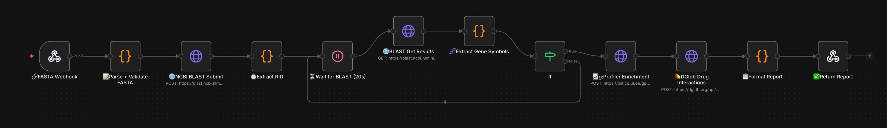

# FASTA to Drug Repurposing Pipeline

An automated bioinformatics pipeline built with [n8n](https://n8n.io/) that transforms raw FASTA DNA sequences into actionable drug repurposing candidates. 

## Workflow Snapshots


## Architecture

The pipeline leverages several APIs to achieve the results:
1. **Webhook Trigger**: Receives a `POST` request with the raw FASTA sequence.
2. **FASTA Parsing & Validation**: Normalizes the string and ensures DNA validity.
3. **NCBI BLAST**: Submits the sequence to the `refseq_rna` database using the `blastn` program to find sequence homologies.
4. **Gene Symbol Extraction**: Extracts standard gene symbols from BLAST hits.
5. **g:Profiler Enrichment**: Finds enriched biological pathways using KEGG, WikiPathways, and Reactome data sources.
6. **DGIdb Lookups**: Uses the Drug Gene Interaction Database (DGIdb) to find existing drug candidates linked to the discovered genes.
7. **HTML Report Generation**: Formats all results into an easy-to-read, styled HTML response.

## Usage

To trigger the pipeline, send a standard HTTP `POST` to the webhook URL. 

```bash
curl -X POST \
  YOUR_WEBHOOK_URL \
  -H 'Content-Type: application/json' \
  -d '{
    "sequence": ">KRAS\nATGACTGAAT..."
  }'
```

The response will be a full HTML page detailing:
- The extracted genes
- Pathway enrichments (KEGG, WikiPathways, Reactome)
- Potential drug interaction candidates and their interaction scores.

## Repository Structure

- `src/FASTA_Drug_Repurposing_Pipeline.workflow.ts` - The primary n8n-as-code TypeScript definition of the pipeline.
- `src/nodes/` - Extracted JavaScript logic for individual nodes.

## Deployment

This project uses [n8n-as-code](https://github.com/homanp/n8n-as-code) (`n8nac`) for infrastructure-as-code workflow deployment. 

1. Install `n8n-as-code`.
2. Configure your environment to point to your n8n instance.
3. Push the workflow to your instance:

```bash
npx --yes n8nac push src/FASTA_Drug_Repurposing_Pipeline.workflow.ts
```

Alternatively, you can import the raw `workflow.json` file directly into your n8n workspace UI.